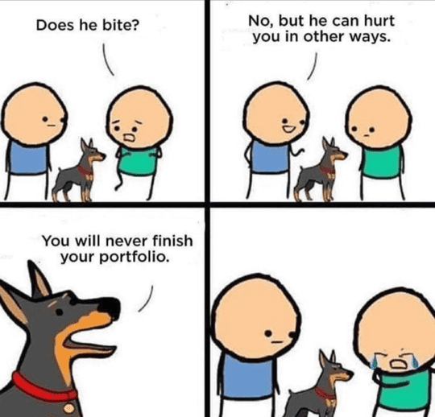
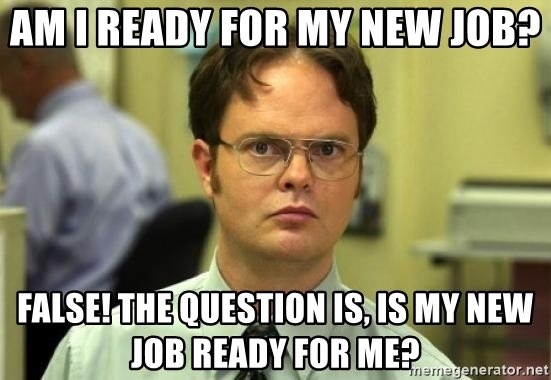
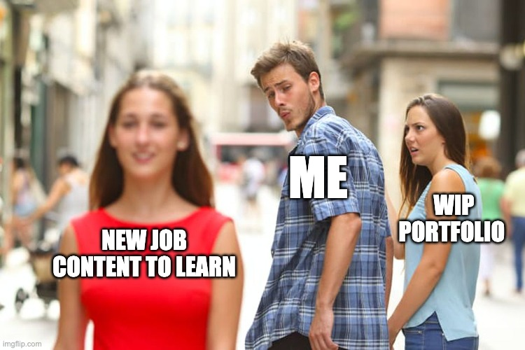
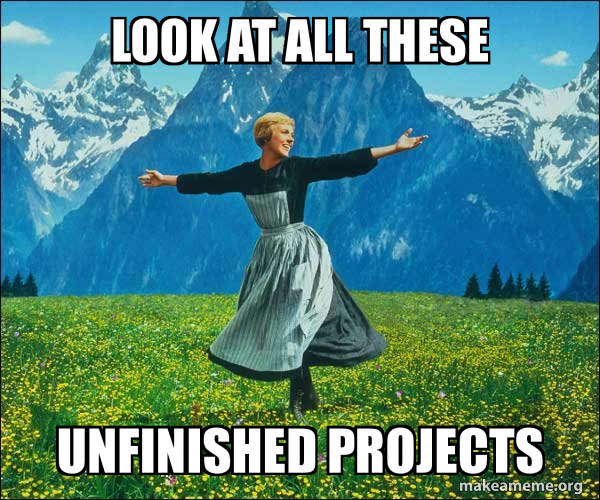

# So, why?

It may sound funny, but surprisingly, in my career, I was never able to finish a portfolio 🥲

     
     <small>At this point I'm just accepting it</small>

## Motivations

To me, creating a portfolio is about my period of **job search**, and now I understand that, luckily or not, that's the reason I only had WIP portfolios but never finished them.

     

### Passive job search 👋🏼

When interested in new opportunities, I start answering LinkedIn contacts, updating the PDF version of my resume, and making myself more visible to recruiters. I call this phase passive job search. I'm really interested, but I'm not investing too much time and effort into it.

### Active job search 👔

I've never got to this phase, but in my plans, it is a moment where I finish my portfolio and study interview stuff (We all know that you need to study a lot of things you'll never use on a daily basis, right ?) to go to a more "door to door" approach, presenting me to companies.

### In-between 🧑🏽‍💻

This "in-between" moment is where I'm at, I decided that the passive job search has no good result and I can do better by going active mode. I have to admit that I'm not a good seller, so I started to create a portfolio page and work on branding and currently, my portfolio is a Work In Progress.

## Am I lucky?

During my career, I only got to the "in-between" phase, where I started my portfolio and received a good job offer shortly after.

### New Motivation

Guess what?! Right after accepting the offer (if my wife allowed it), my focus and motivations **completely change**.

With a new job I have A LOT to learn and to adapt, even if I have all the skills to hit the ground running, there is a whole new universe in front of me and I need to learn and understand it to be able to contribute and be successfull.

     

## This portfolio?

Hopefully, I gotta be lucky again and get my dream job without a finished portfolio. But for the first time, I'm using VitePress and have the help of IA, so I feel things can be different this time.

One thing is right: I stopped feeling blame or shame for not dedicating time to finish a portfolio, I guess it is more about how I function and put my focus on what is important to me.

     

Thanks for taking the time to understand my motivations. I really appreciate it 🥰
